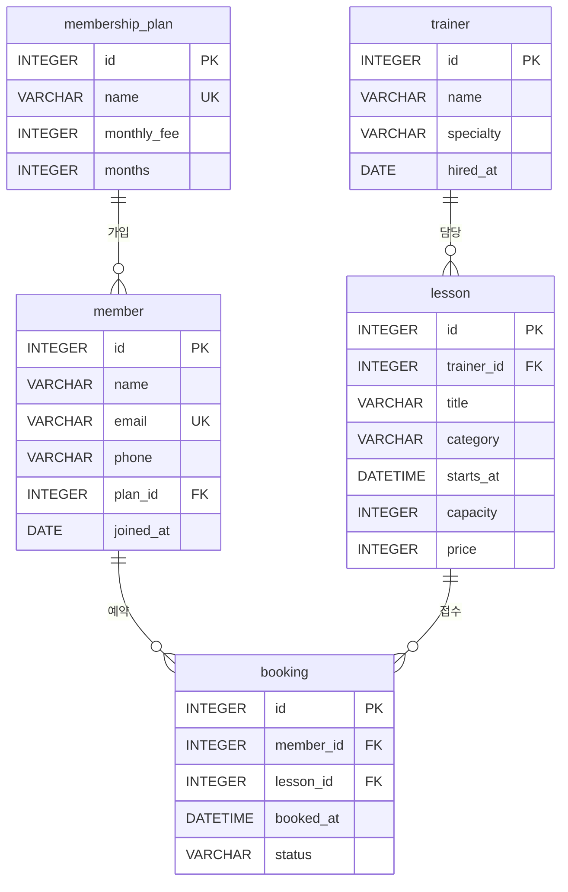

# 피트니스 수업 예약 DB — 디지털 서랍장 (b6-1)

> 회원이 수업을 예약하는 피트니스 센터를 **테이블 5개, 1:N 관계 4개**로 설계하고, 샘플 데이터와 핵심 쿼리 16개를 SQLite로 실행해 결과를 텍스트로 남겼다.
> 백엔드 프레임워크 없이 **SQL 파일 3개 + Bash 스크립트 + Python 표준 라이브러리 테스트**만 쓴다.

| | |
|---|---|
| 주제 | 피트니스 수업 예약 (회원 · 멤버십 상품 · 트레이너 · 수업 · 예약) |
| DB | SQLite (검증: 3.51.0, `sqlite3` CLI) |
| 테이블 / 관계 | 5개 / 1:N 4개 |
| 샘플 데이터 | 멤버십 상품 10 · 회원 15 · 트레이너 10 · 수업 15 · 예약 30 (각 테이블 10행 이상) |
| 핵심 쿼리 | 16개 (기본 조회 4 · INNER JOIN 2 · LEFT JOIN 2 · 집계 3 · 서브쿼리 2 · 수정 1 · 삭제 1 · 인덱스 1) |
| 실행 | `bash scripts/run_all.sh` |
| 테스트 | Python `unittest` 26개 (`python3 -m unittest discover -s tests -t . -v`) |
| 기준일 | 2026-10-01 고정 (`date('now')`를 쓰지 않아 결과가 언제나 같다) |

설계 결정은 [PLAN.md](PLAN.md), 과제 목표와 평가 문항 답변은 [EXPLAIN.md](EXPLAIN.md)에 있다.

---

## 목차

1. [실행 방법](#실행-방법)
2. [ERD](#erd)
3. [테이블 설명](#테이블-설명)
4. [제약 조건](#제약-조건)
5. [쿼리 16개](#쿼리-16개)
6. [핵심 결과 발췌](#핵심-결과-발췌)
7. [FK 차단 증거](#fk-차단-증거)
8. [폴더 구조](#폴더-구조)
9. [요구사항 체크리스트](#요구사항-체크리스트)
10. [검증](#검증)

---

## 실행 방법

필요한 것은 `sqlite3` CLI(검증: 3.51.0)와 Bash뿐이다. 설치할 패키지는 없다. 저장소 루트에서 실행한다.

```bash
bash scripts/run_all.sh
```

이 스크립트는 다음을 순서대로 한다. 몇 번을 다시 실행해도 같은 결과가 나온다.

1. `fitness.db`를 지우고 새로 만든다.
2. `sql/01_schema.sql` → `sql/02_seed.sql`을 `sqlite3 -bail`로 실행한다.
3. `sql/03_queries.sql`을 `-- Qnn [범주] 설명` 머리 주석마다 잘라, 쿼리마다 `PRAGMA foreign_keys = ON;`을 먼저 실행한 뒤 `.headers on` / `.mode column`으로 실행한다.
4. 쿼리 원문과 실행 결과를 `results/Q01.txt` ~ `results/Q16.txt`에 저장한다.
5. 없는 부모를 참조하는 입력이 막히는지 시도해 `results/fk-check.txt`에 남긴다.

### CLI로 직접 열어 보기

`run_all.sh`가 끝난 `fitness.db`는 수정·삭제 쿼리(Q14, Q15)와 인덱스(Q16)가 **이미 적용된 상태**다. 처음 상태의 DB가 필요하면 직접 만든다.

```bash
sqlite3 my.db < sql/01_schema.sql
sqlite3 my.db < sql/02_seed.sql
sqlite3 my.db
```

```text
sqlite> PRAGMA foreign_keys = ON;   -- 연결마다 먼저 켠다. 기본값은 OFF 라서 켜지 않으면 FK가 막아 주지 않는다
sqlite> .headers on
sqlite> .mode column
sqlite> SELECT * FROM lesson WHERE category = '요가';
```

### 테스트 실행

```bash
python3 -m unittest discover -s tests -t . -v
```

`-t .`는 저장소 루트를 최상위로 지정해 `from tests.helpers import ...`가 풀리게 한다. 테스트는 Python 표준 `sqlite3`로 **메모리 DB**를 만들어 SQL 파일을 실행하고, `run_all.sh`는 실제로 한 번 돌려 본다.

---

## ERD



`booking`은 `member`와 `lesson` 사이의 연결 테이블이다. 회원과 수업은 서로 다대다지만, 그 사이에 "언제 예약했고 지금 상태가 무엇인가"라는 사실이 있어서 독립된 테이블로 두었다. 같은 회원이 같은 수업을 두 번 예약하지 못하도록 `UNIQUE (member_id, lesson_id)`를 건다.

---

## 테이블 설명

| 테이블 | 역할 | 행 수 | 핵심 컬럼 |
|---|---|---|---|
| `membership_plan` | 멤버십 상품(이용권). 회원이 가입하는 단위 | 10 | `name` UNIQUE, `monthly_fee`(원), `months`(개월) |
| `member` | 회원. 하나의 상품에 속한다 | 15 | `email` UNIQUE, `plan_id` FK, `joined_at` DATE |
| `trainer` | 수업을 맡는 트레이너 | 10 | `specialty`(전문 분야), `hired_at` |
| `lesson` | 개설된 수업의 1회차. 한 트레이너가 맡는다 | 15 | `trainer_id` FK, `category`, `starts_at` DATETIME, `capacity`, `price` |
| `booking` | 회원의 수업 예약 | 30 | `member_id` FK, `lesson_id` FK, `booked_at`, `status` |

| 1:N 관계 | 도메인에서의 의미 |
|---|---|
| `membership_plan` 1 : N `member` | 한 상품에 여러 회원이 가입한다 (`member.plan_id`) |
| `member` 1 : N `booking` | 한 회원이 여러 수업을 예약한다 (`booking.member_id`) |
| `trainer` 1 : N `lesson` | 한 트레이너가 여러 수업을 맡는다 (`lesson.trainer_id`) |
| `lesson` 1 : N `booking` | 한 수업에 여러 회원이 예약한다 (`booking.lesson_id`) |

예약 상태(`booking.status`)는 4가지다: `booked`(예약), `attended`(출석), `cancelled`(취소), `no_show`(불참).

---

## 제약 조건

| 종류 | 위치 | 효과 |
|---|---|---|
| PK | 5개 테이블의 `id` | 행을 하나로 특정한다 |
| FK | `member.plan_id`, `lesson.trainer_id`, `booking.member_id`, `booking.lesson_id` | 없는 부모를 참조하는 입력을 막는다 |
| `ON DELETE RESTRICT` | FK 4개 전부 | 자식이 있는 부모를 지우면 오류. 예약이 고아로 남지 않는다 |
| UNIQUE | `membership_plan.name`, `member.email` | 같은 상품명·이메일 중복 금지 |
| UNIQUE (복합) | `booking(member_id, lesson_id)` | 같은 회원이 같은 수업을 두 번 예약할 수 없다 |
| NOT NULL | PK를 제외하고 전화번호(`member.phone`)를 뺀 모든 컬럼 | 필수 값 누락 금지 |
| CHECK | `monthly_fee >= 0`, `months > 0`, `capacity > 0`, `price >= 0` | 말이 안 되는 숫자 금지 |
| CHECK | `status IN ('booked','attended','cancelled','no_show')` | 허용 상태 4개 외의 값 금지 |

> **SQLite 전용 문법**은 `-- [SQLite 전용]` 주석으로 표시했다: `PRAGMA foreign_keys`, `PRAGMA foreign_key_check`, `EXPLAIN QUERY PLAN`, `INTEGER PRIMARY KEY`의 rowid 별칭 동작. 날짜 함수(`strftime`, `date('now')`)와 `||` 연결은 쓰지 않았다.

---

## 쿼리 16개

머리 주석 형식은 `-- Qnn [범주] 한 줄 설명`이다. `scripts/run_all.sh`와 테스트가 이 형식으로 쿼리를 나눈다. 수정·삭제·인덱스(Q14~Q16)는 앞 쿼리 결과를 바꾸지 않도록 파일 맨 끝에 두었다.

| 번호 | 범주 | 설명 | 결과 |
|---|---|---|---|
| Q01 | 기본조회 | 요가 카테고리 수업을 시작 시각 순으로 조회 (WHERE + ORDER BY) | [Q01.txt](results/Q01.txt) |
| Q02 | 기본조회 | 수강료가 높은 상위 5개 수업 (ORDER BY DESC + LIMIT 5) | [Q02.txt](results/Q02.txt) |
| Q03 | 기본조회 | 2026년에 가입한 회원을 가입일 순으로 조회 | [Q03.txt](results/Q03.txt) |
| Q04 | 기본조회 | 정원 15명 이상이면서 수강료 2만 원 이하인 수업 | [Q04.txt](results/Q04.txt) |
| Q05 | INNER JOIN | 예약 목록: 회원명·수업명·시작 시각·상태 (booking, member, lesson 3테이블) | [Q05.txt](results/Q05.txt) |
| Q06 | INNER JOIN | 수업별 담당 트레이너와 전문 분야 | [Q06.txt](results/Q06.txt) |
| Q07 | LEFT JOIN | 회원별 예약 수 (예약이 없는 회원도 0건으로 포함) | [Q07.txt](results/Q07.txt) |
| Q08 | LEFT JOIN | 예약이 한 건도 없는 수업 (`IS NULL`) | [Q08.txt](results/Q08.txt) |
| Q09 | 집계 | 취소를 제외한 예약 인원이 3명 이상인 수업 (COUNT + GROUP BY + HAVING) | [Q09.txt](results/Q09.txt) |
| Q10 | 집계 | 트레이너별 매출 (출석·예약 상태만, SUM(price)) | [Q10.txt](results/Q10.txt) |
| Q11 | 집계 | 멤버십 이용 기간별 회원 수와 평균 월회비 (COUNT + AVG) | [Q11.txt](results/Q11.txt) |
| Q12 | 서브쿼리 | 전체 평균 수강료보다 비싼 수업 (스칼라 서브쿼리) | [Q12.txt](results/Q12.txt) |
| Q13 | 서브쿼리 | 예약 기록이 없는 회원 (`NOT EXISTS`) | [Q13.txt](results/Q13.txt) |
| Q14 | 수정 | 기준일 이전 수업에 남은 `booked` → `no_show` (전후 SELECT 포함) | [Q14.txt](results/Q14.txt) |
| Q15 | 삭제 | `cancelled` 예약 삭제 (전후 COUNT 포함) | [Q15.txt](results/Q15.txt) |
| Q16 | 인덱스 | `booking.lesson_id` 인덱스 + 이유 + `EXPLAIN QUERY PLAN` 전후 비교 | [Q16.txt](results/Q16.txt) |

각 `results/Qnn.txt`는 **쿼리 원문**과 `-- 실행 결과` 아래의 **실제 출력**을 함께 담는다. 출력은 `sqlite3` CLI가 만든 그대로이며 손으로 고치지 않았다.

---

## 핵심 결과 발췌

### 1. INNER JOIN과 LEFT JOIN — Q06 / Q07

Q07은 `member`를 기준으로 `booking`을 LEFT JOIN 해서 예약이 없는 회원(장예은, 신채원, 권태양)을 **0건으로 남긴다**.

```text
member_id  name    booking_count
---------  ------  -------------
1          김민준  3
2          이서연  3
3          박지호  3
4          최유진  3
6          강도현  3
8          윤지우  3
10         임준서  3
11         한소율  3
7          조수아  2
13         서현우  2
5          정하윤  1
12         오지안  1
9          장예은  0
14         신채원  0
15         권태양  0
```

같은 질문을 JOIN 종류만 바꿔 실행하면 행 수가 달라진다. (스키마와 시드만 적용한 처음 상태의 DB에서 한 임시 실행이라 `results/`에는 없다. `.headers on` / `.mode column` 상태의 `sqlite3`에서 아래 쿼리를 그대로 실행하면 된다.)

```text
-- 임시 실행: Q06·Q07 의 JOIN 종류만 INNER / LEFT 로 바꿔 결과 행 수를 센다
SELECT 'Q06 수업-트레이너' AS pair, 'INNER JOIN' AS join_type, COUNT(*) AS result_rows
FROM lesson l INNER JOIN trainer t ON t.id = l.trainer_id
UNION ALL
SELECT 'Q06 수업-트레이너', 'LEFT JOIN', COUNT(*)
FROM lesson l LEFT JOIN trainer t ON t.id = l.trainer_id
UNION ALL
SELECT 'Q07 회원별 예약 수', 'INNER JOIN', COUNT(*)
FROM (SELECT m.id FROM member m INNER JOIN booking b ON b.member_id = m.id GROUP BY m.id)
UNION ALL
SELECT 'Q07 회원별 예약 수', 'LEFT JOIN', COUNT(*)
FROM (SELECT m.id FROM member m LEFT JOIN booking b ON b.member_id = m.id GROUP BY m.id);

pair                join_type   result_rows
------------------  ----------  -----------
Q06 수업-트레이너   INNER JOIN  15
Q06 수업-트레이너   LEFT JOIN   15
Q07 회원별 예약 수  INNER JOIN  12
Q07 회원별 예약 수  LEFT JOIN   15
```

- **회원별 예약 수(Q07)**: INNER JOIN은 짝이 있는 12명만 남기고 예약이 없는 3명이 사라진다. LEFT JOIN은 15명 모두 남기고 짝이 없는 쪽을 `NULL`로 채우므로 `COUNT(b.id)`가 0이 된다.
- **수업-트레이너(Q06)**: `lesson.trainer_id`가 `NOT NULL` + FK라서 모든 수업에는 트레이너가 반드시 있다. 그래서 INNER JOIN과 LEFT JOIN의 결과가 같다(15행). "짝이 없을 수 있는 쪽"이 어디인지는 FK 방향과 NOT NULL로 정해진다.

### 2. 집계 — Q09 (COUNT + GROUP BY + HAVING)

취소를 뺀 예약 인원을 수업별로 세고, 3명 이상인 수업만 남긴다. `WHERE`는 행을 먼저 거르고, `HAVING`은 묶은 뒤의 집계 값을 거른다.

```text
lesson_id  title               capacity  booked_count  fill_rate_pct
---------  ------------------  --------  ------------  -------------
3          파워 스피닝 45      20        4             20.0
2          코어 필라테스 기초  8         3             37.5
4          줌바 댄스 입문      25        3             12.0
9          리포머 필라테스     6         3             50.0
```

### 3. UPDATE 전후 — Q14

기준일(2026-10-01)보다 이전인데도 `booked`로 남은 예약 3건(18, 20, 24)을 `no_show`로 바꾼다. 이미 `no_show`이던 2건(6, 13)과 합쳐 5건이 된다.

```text
stage    booking_id  member_name  lesson_title          starts_at         status
-------  ----------  -----------  --------------------  ----------------  ------
변경 전  18          조수아       힐링 요가             2026-09-18 10:00  booked
변경 전  20          오지안       복싱 기초 콤비네이션  2026-09-25 20:00  booked
변경 전  24          이서연       리포머 필라테스       2026-09-29 11:00  booked
stage    booking_id  member_name  lesson_title          starts_at         status
-------  ----------  -----------  --------------------  ----------------  -------
변경 후  6           정하윤       코어 필라테스 기초    2026-09-04 19:00  no_show
변경 후  13          한소율       줌바 댄스 입문        2026-09-10 19:30  no_show
변경 후  18          조수아       힐링 요가             2026-09-18 10:00  no_show
변경 후  20          오지안       복싱 기초 콤비네이션  2026-09-25 20:00  no_show
변경 후  24          이서연       리포머 필라테스       2026-09-29 11:00  no_show
stage         stale_booked
------------  ------------
변경 후 확인  0
```

### 4. 인덱스 — Q16

`booking.lesson_id`로 찾는 쿼리의 실행 계획이 전체 스캔(`SCAN`)에서 인덱스 검색(`SEARCH ... USING INDEX`)으로 바뀐다.

```text
stage
--------------
인덱스 생성 전
QUERY PLAN
`--SCAN booking
stage
--------------
인덱스 생성 후
QUERY PLAN
`--SEARCH booking USING INDEX idx_booking_lesson_id (lesson_id=?)
```

`UNIQUE (member_id, lesson_id)`가 만든 자동 인덱스(`sqlite_autoindex_booking_1`)는 `member_id`가 앞이라 `lesson_id` 단독 조건에는 쓰이지 않는다. 그래서 별도 인덱스가 필요했다.

---

## FK 차단 증거

`results/fk-check.txt` 전체다. `PRAGMA foreign_keys = ON` 상태에서 없는 회원·수업을 참조하는 INSERT와, 예약이 있는 회원 DELETE가 모두 `FOREIGN KEY constraint failed`로 막힌다.

```text
-- FK 차단 확인 (PRAGMA foreign_keys = ON 상태) -- [SQLite 전용]
-- 아래 입력은 모두 실패해야 정상이다. 실패 메시지는 sqlite3 가 출력한 그대로다.

-- [1] 존재하지 않는 member_id(999)로 예약 INSERT
INSERT INTO booking (member_id, lesson_id, booked_at, status) VALUES (999, 1, '2026-10-01 10:00', 'booked');
Runtime error near line 2: FOREIGN KEY constraint failed (19)

-- [2] 존재하지 않는 lesson_id(999)로 예약 INSERT
INSERT INTO booking (member_id, lesson_id, booked_at, status) VALUES (1, 999, '2026-10-01 10:00', 'booked');
Runtime error near line 2: FOREIGN KEY constraint failed (19)

-- [3] 예약이 있는 회원(id=1) 삭제 시도 (ON DELETE RESTRICT)
DELETE FROM member WHERE id = 1;
Runtime error near line 2: FOREIGN KEY constraint failed (19)

-- [4] 실패한 입력이 아무 흔적도 남기지 않았는지 확인 -- [SQLite 전용] 출력이 없으면 FK 위반 행이 0건이다
PRAGMA foreign_key_check;
-- (끝)
```

> **주의**: `sqlite3`는 연결마다 FK 강제가 **꺼진 채** 시작한다. 이 프로젝트는 `run_all.sh`의 모든 쿼리 실행, 테스트의 모든 연결에서 `PRAGMA foreign_keys = ON`을 먼저 실행한다. FK를 켜지 않으면 같은 INSERT가 그대로 성공해서 고아 행이 생긴다. 실제로 켜지 않고 시도한 결과는 [EXPLAIN.md](EXPLAIN.md)의 "어려웠던 점"에 있다.

---

## 폴더 구조

```text
.
├── sql/
│   ├── 01_schema.sql      CREATE TABLE (PK·FK·UNIQUE·NOT NULL·CHECK)
│   ├── 02_seed.sql        샘플 데이터 INSERT (부모 → 자식 순서)
│   └── 03_queries.sql     핵심 쿼리 16개
├── scripts/run_all.sh     새 DB 생성 → 쿼리별 실행 → results/ 저장
├── results/               Q01.txt ~ Q16.txt, fk-check.txt (실제 실행 출력)
├── tests/                 표준 unittest 26개
├── README.md  PLAN.md  EXPLAIN.md
└── .gitignore             *.db, __pycache__/
```

---

## 요구사항 체크리스트

**최종 결과물 (미션 2장)**

- [x] 도메인 데이터베이스 1개: 피트니스 수업 예약, 테이블 5개, 1:N 관계 4개 — [`sql/01_schema.sql`](sql/01_schema.sql)
- [x] 스키마 생성 스크립트 1개: `CREATE TABLE` + PK·FK·제약조건, 실행 순서대로 정리 — `sql/01_schema.sql`
- [x] 샘플 데이터 입력 스크립트 1개: 테이블마다 10행 이상 — [`sql/02_seed.sql`](sql/02_seed.sql)
- [x] 핵심 쿼리 15개 이상 + 실행 결과 텍스트: 16개 — [`sql/03_queries.sql`](sql/03_queries.sql), [`results/`](results/)

**기능 요구 사항 (미션 4장)**

- [x] DB 환경 준비: SQLite 3.51 + `sqlite3` CLI
- [x] 최소 4개 테이블(5개), 각 테이블 PK, FK 2개 이상(4개)
- [x] 컬럼 타입을 의미에 맞게 선택(INTEGER / VARCHAR / DATE / DATETIME), 이름은 역할이 드러나게(`member`, `booking`, `starts_at`) — 근거는 [PLAN.md](PLAN.md) 5장
- [x] NOT NULL 적용(`member.name` 외 다수), UNIQUE 적용(`member.email` 외), **FK가 실제로 동작**(없는 값 참조 차단) — [`results/fk-check.txt`](results/fk-check.txt), `tests/test_schema.py`
- [x] 각 테이블 10행 이상, FK로 연결된 데이터, 부모 테이블을 먼저 INSERT
- [x] 기본 조회 4개 이상(WHERE·ORDER BY·LIMIT 포함): Q01~Q04
- [x] 조인 4개 이상(INNER JOIN 2개 이상 + LEFT JOIN 1개 이상): Q05, Q06 / Q07, Q08
- [x] 집계 3개 이상(COUNT·SUM·AVG 모두 사용 + GROUP BY): Q09, Q10, Q11
- [x] 서브쿼리 1개 이상: Q12, Q13
- [x] 수정·삭제 2개 이상(전후 SELECT 포함): Q14 UPDATE, Q15 DELETE
- [x] 인덱스 1개 이상(CREATE INDEX + 적용 이유 1줄): Q16
- [x] 쿼리마다 실행 결과 확인 자료와 한 줄 설명: `results/Qnn.txt`, 머리 주석
- [x] 제출물: 스키마 SQL 1개, 시드 SQL 1개, 쿼리 SQL 1개, 결과 텍스트 폴더 1개, ERD는 Mermaid로 이 문서에 포함
- [x] DB 고유 문법은 `[SQLite 전용]` 주석으로 표시

**제약 사항 (미션 7장)**

- [x] 백엔드 프레임워크 없음 (SQL + Bash + Python 표준 라이브러리)
- [x] 뷰·프로시저·트리거 없음
- [x] 보너스 과제는 수행하지 않음

---

## 검증

테스트는 SQL 파일을 메모리 DB에서 실제로 실행해 요구사항을 확인한다. 26개 중 15개(스키마 5 · 시드 3 · 쿼리 3 · 실행 스크립트 4)는 SQL과 스크립트가 없는 상태에서 먼저 실패(RED)하는 것을 확인한 뒤 구현했다. 나머지 11개(스키마 4 · 쿼리 7)는 구현 후 리뷰 포인트(`ON DELETE RESTRICT`, 수정·삭제 쿼리의 위치와 전후 변화, 인덱스 사용 등)를 보강하려고 덧붙인 것이다. 이 11개는 RED를 따로 보지 않았고, 대신 일부러 SQL·스크립트를 망가뜨려 테스트가 실패하는지 확인했다. 두 부류 모두 `test:` 커밋에 함께 들어 있다.

| 파일 | 개수 | 확인하는 것 |
|---|---|---|
| `tests/test_schema.py` | 9 | PK, FK 4개 이상, 없는 부모 참조 차단, UNIQUE·NOT NULL·CHECK, `ON DELETE RESTRICT`, 자식이 있는 부모 삭제 차단 |
| `tests/test_seed.py` | 3 | 테이블마다 10행 이상, FK 무결성(`PRAGMA foreign_key_check`), 예약 없는 회원·수업, 4가지 status, 기준일 이전 `booked` |
| `tests/test_queries.py` | 10 | 머리 주석 기준 분리, 범주별 개수, 번호 순서 실행, 읽기 쿼리 결과 비어 있지 않음, 수정·삭제 쿼리가 끝쪽에 위치, UPDATE·DELETE 전후 변화, 인덱스 사용, `date('now')` 미사용 |
| `tests/test_run_all.py` | 4 | `run_all.sh` 두 번 실행 성공, 결과 파일 16개의 원문·출력, 결과 재현성, FK 차단 기록 |

실행 결과:

```text
$ python3 -m unittest discover -s tests -t .
..........................
----------------------------------------------------------------------
Ran 26 tests in 0.633s

OK
```

---

## 한계와 메모

- 샘플 데이터는 모두 가상이다. 이메일은 예약 도메인 `example.com`을 쓴다.
- `.mode column` 출력의 열 너비는 셀 내용에 맞춰 자동으로 정해진다. `sqlite3` 3.51.0에서는 한글이 든 열도 표시 폭 기준으로 맞춰서 나왔다. 글꼴이 고정폭이 아닌 화면에서는 어긋나 보일 수 있다.
- 정원(`capacity`)을 넘는 예약을 막는 제약은 두지 않았다. 이는 `CHECK`로 표현할 수 없고(다른 테이블의 행 수를 세야 한다) 트리거가 필요한데, 미션이 트리거 사용을 금지한다.
